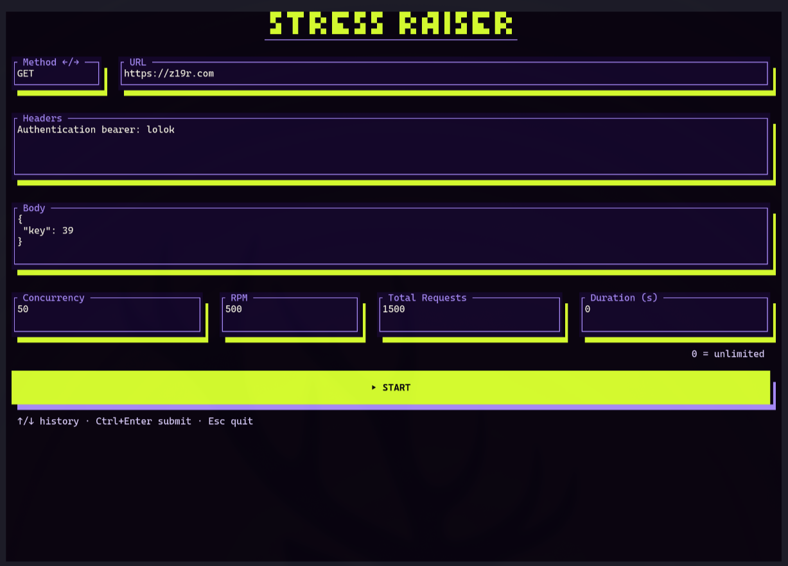
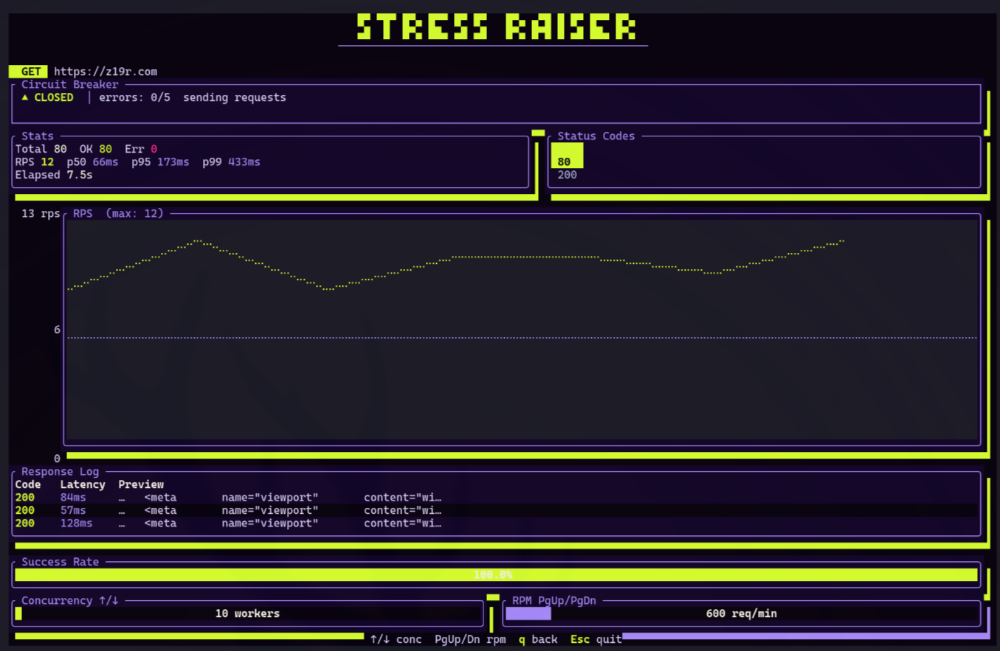
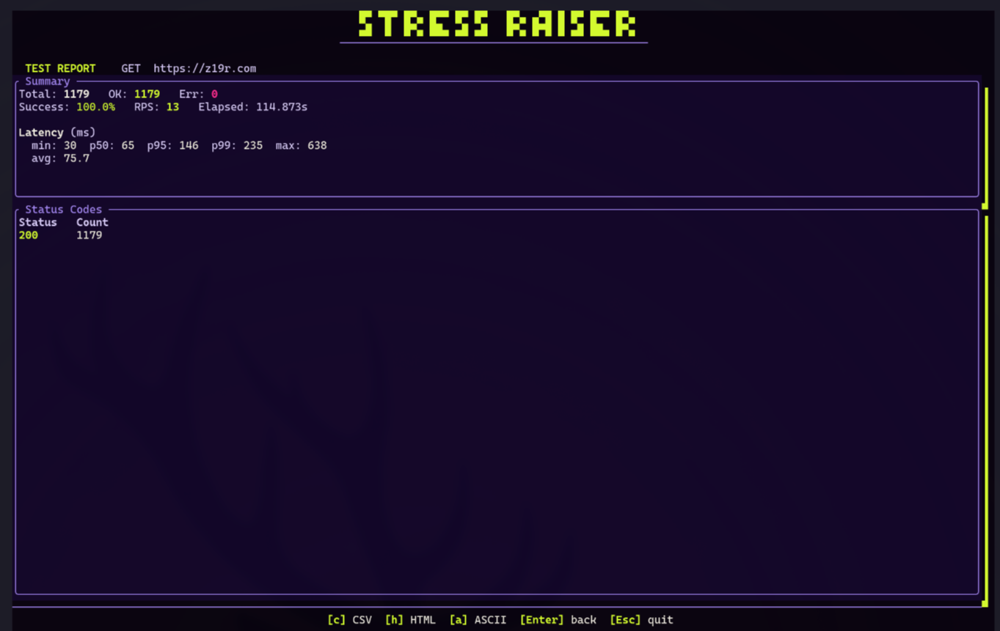

# stress-raiser

Beautiful Rust stress tester with a form (URL, method, headers, body) and a
live TUI: stats, circuit breaker, and sparklines.

## Screenshots

**Form** — URL, method, headers, body, concurrency, RPM. Enter to start.



**Dashboard** — Live stats, circuit breaker, RPS sparkline, success rate.



**Report** - Simple report when you're all done.



## Install

```bash
cargo install --path .
```

Or clone the repo (or extract the archive you were sent). From the project
root:

```bash
cargo build --release
```

All development and run tasks use [just](https://github.com/casey/just); run
`just` with no arguments to start the app.

## Usage

Run with no CLI arguments:

```bash
just
# or: cargo run
```

The app has two phases:

1. **Form** — Enter URL, method, headers, body, concurrency, and RPM. Start
   the load test with Enter.
2. **Dashboard** — Live load test with real-time stats. Return to the form
   with q or Backspace; quit the app with Esc.

### Keybindings

**Form**

| Key                     | Action                         |
| ----------------------- | ------------------------------ |
| Tab                     | Next field                     |
| Shift+Tab               | Previous field                 |
| Enter                   | Start load test (when URL set) |
| ↑/↓ (in URL)            | Cycle through request history  |
| Ctrl+↑/↓ (Headers/Body) | Cycle request history          |
| Esc                     | Quit                           |

**Dashboard**

| Key           | Action            |
| ------------- | ----------------- |
| ↑/↓           | Concurrency (±10) |
| PgUp/PgDn     | RPM (±10)         |
| q / Backspace | Back to form      |
| Esc           | Quit              |

## Config / data

History is stored in:

- `$XDG_DATA_HOME/stress-raiser/history.json` if `XDG_DATA_HOME` is set
- Otherwise `~/.local/share/stress-raiser/history.json`
- Otherwise `./stress-raiser/history.json`

Persistence is best-effort; missing or invalid files are ignored.

## Examples

Enter a URL (e.g. `https://example.com`) in the URL field, choose method (GET,
POST, etc.), add headers and body in their fields, then start the load test.

## Releasing a new version

Prerequisites: [cargo-edit](https://github.com/killercup/cargo-edit) (`cargo install cargo-edit`) and [gh](https://cli.github.com/).

### 1. Run the quality gate

```bash
just release-check
```

Runs `cargo fmt --check`, `cargo clippy -- -D warnings`, and `cargo test`.
Fix anything that fails before continuing.

### 2. Preview the release (optional)

```bash
just release-dry-run patch   # or minor / major
```

Shows the current version, the bump level, and re-runs the quality gate.
No files are changed.

### 3. Cut the release

```bash
just release patch           # or minor / major
```

This will:
- Verify you're on `main` with a clean tree
- Pull latest from origin
- Bump the version in `Cargo.toml` + `Cargo.lock`
- Create a `release/vX.Y.Z` branch
- Commit and push the branch
- Open a PR via `gh pr create`

### 4. Watch CI on the PR

```bash
gh pr checks
```

Wait for all checks to pass (fmt, clippy, tests).

### 5. Merge the PR

```bash
gh pr merge --squash --delete-branch
```

### 6. Watch the release workflow

```bash
gh run watch
```

Once the PR merges to `main` and CI detects the `Cargo.toml` version change,
the release workflow automatically:

1. Reads the version and checks the tag doesn't already exist
2. Runs the full quality gate again
3. Cross-compiles for 4 targets (x86_64/aarch64 Linux, x86_64/aarch64 macOS)
4. Creates a git tag `vX.Y.Z`
5. Publishes a GitHub Release with tarballs + SHA256 checksums
6. Publishes to [crates.io](https://crates.io/crates/stress-raiser)

### 7. Verify

```bash
gh release view                     # check the GitHub release
cargo install stress-raiser         # install from crates.io
stress-raiser --version             # confirm the new version
```

### Version bump levels

| Level   | When to use                                      | Example        |
| ------- | ------------------------------------------------ | -------------- |
| `patch` | Bug fixes, minor UI tweaks, docs                 | 1.2.1 → 1.2.2 |
| `minor` | New features, non-breaking changes               | 1.2.2 → 1.3.0 |
| `major` | Breaking changes (CLI flags, config, public API) | 1.3.0 → 2.0.0 |

## Development

| Command              | Description                        |
| -------------------- | ---------------------------------- |
| `just`               | Run the app                        |
| `just test`          | Run tests                          |
| `just fmt`           | Format code                        |
| `just check`         | Check + clippy                     |
| `just doc`           | Build and open API docs            |
| `just publish-check` | Fmt, clippy, test, dry-run publish |
| `just publish`       | Publish to crates.io               |
